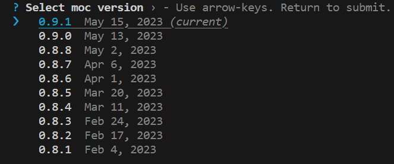

# Motoko Compiler(moc) version manager

## Quick Start
Install
```
npm i mocv -g
mocv init
```
Select `moc` version
```
mocv
```


## Use in GitHub workflows
Simply add this step
```
- name: Select moc version
  run: echo "DFX_MOC_PATH=$(npx mocv bin latest)/moc" >> $GITHUB_ENV
```

Instead of `latest` you can specify the version of moc, for example `0.9.1`

## Setup

### Install `mocv`
```
npm i mocv -g
```

### Set env var DFX_MOC_PATH
This command adds a line to `.bashrc` to set `DFX_MOC_PATH` to the current `moc` version
```
mocv init
```

Or you can add by yourself:

Run `mocv bin current`, copy result and add the line below to your `.bashrc`
```
export DFX_MOC_PATH=<result>/moc
```

## Usage
### Select moc version
You will be prompted to select one of the available `moc` versions
```
mocv
```
or
```
mocv use 0.8.4
```
or
```
mocv use latest
```

Done!

Now dfx will use current `moc` version when you build canisters with `dfx build` or `dfx deploy`

## Other use cases
If you want to use specific version of `moc` to deploy a canister:
```
DFX_MOC_PATH=$(mocv bin 0.8.3)/moc dfx deploy my_canister
```

## Reset
Revert changes made by `mocv init`
```
mocv reset
```